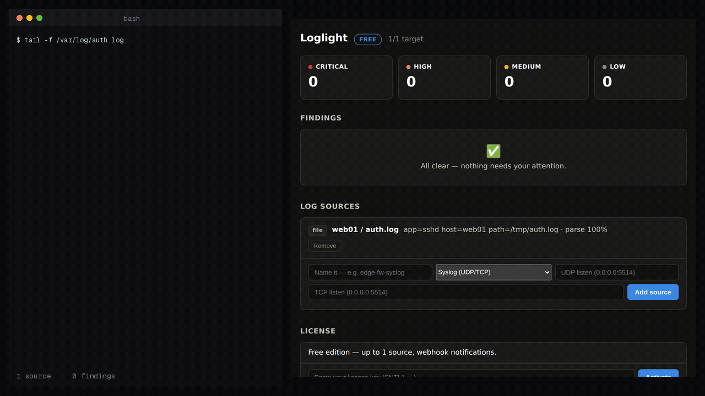

# Loglight

**Self-hosted threat detection from your logs — brute force, scans, exfiltration, and correlated kill-chains.**



*Real run: a port sweep, then failed logins, then one that works — all from the same address, 30
seconds end to end. Three separate detections become one CRITICAL incident with the kill chain
attached, instead of three alerts you have to correlate yourself.*

You have logs. `auth.log`, your firewall's syslog, a few Windows boxes, some
containers. Nobody reads them — so if you're being brute-forced or something is
beaconing out, you find out a week too late. A full SIEM (Splunk, Elastic) is a
project you don't have time for. Loglight is the **SIEM-lite** for that gap.

Point your logs at it and Loglight runs curated, high-signal detections and shows
a short, ranked list of *what looks like an attack*:

- **Brute force / credential stuffing** — failed-login bursts per IP, or distributed across many.
- **Port & host scans** — one source touching many distinct ports fast.
- **Abnormal egress** — outbound volume far above a host's baseline (possible exfiltration).
- **New privileged accounts** — `useradd`, sudoers/group changes, Windows 4720/4728 — the classic persistence step.

> The SIEM part: it **correlates**. A scan, then a brute force, then a successful
> login from the same source isn't three blips — it's one **CRITICAL kill-chain
> incident**, escalated above its parts, with the full timeline.

Every finding shows the numbers behind it and the fix — it ranks and explains, it
doesn't hand you a black box. Under the hood: bounded-state streaming detectors +
a per-actor correlation state machine — turning an unbounded log firehose into a
small, explained, ranked set of incidents without a query language.

## Ingest sources

syslog (UDP/TCP, RFC3164 & RFC5424), tailed files (rotation-safe), systemd
journald, Docker containers, and Windows Event Log (via a syslog forwarder). All
normalize to one event model, so every detector works across every source.

## Self-hosted by design

Runs as a single binary or container on your infrastructure. **Your logs never
leave the machine** — no telemetry, no shipping to us, only the alert channels you
configure reach out. Offline license validation — no phone-home, ever. Safe to
run on an isolated management host.

## Quick start

```bash
# Docker (map any syslog listener ports you configure)
docker run -d -p 127.0.0.1:8427:8427 -p 5514:5514/udp -v loglight-data:/data loglight

# Or the bare binary
./loglight
```

Open `http://127.0.0.1:8427`, add a log source (start with a syslog listener or
tail `/var/log/auth.log`), point your hosts at it, and watch the findings — worst
first.

## Free vs paid

This repository is the **free edition**: **1 source**, all five detections,
webhook notifications, 3-day retention, self-hosted, no telemetry. It runs the
same detection engine as the paid edition.

The paid edition ([Loglight on Whop](https://whop.com/loglight)) lifts the caps
and adds the correlation layer and team features:

| | Free | Pro | Team |
|---|---|---|---|
| Sources | 1 | 10 | unlimited |
| Detections (brute, scan, exfil, new-admin, spike) | ✓ | ✓ | ✓ |
| Kill-chain correlation | — | ✓ | ✓ |
| Custom thresholds · scan-now | — | ✓ | ✓ |
| Notifications | webhook | + email/Slack/Telegram | + PagerDuty/MS Teams |
| Retention | 3 days | 30 days | unlimited (disk-bound) |
| Multi-user | — | — | ✓ |
| Support | community | email | priority |

Licensing is offline: an expired or absent key simply returns to free limits.

## Build from source

```bash
git clone https://github.com/nizartuanku/loglight
cd loglight
CGO_ENABLED=1 go build -o loglight ./cmd/loglight
go test ./...
```

Requires Go 1.24+. CGO is on for the SQLite driver.

## Working with the other Sentinel tools

Loglight is the collector end of the line. Every other Sentinel tool can emit
its findings as syslog, so point them here:

```bash
decoy      -syslog loglight.internal:5514        # udp by default
certwatch  -syslog loglight.internal:5514 -syslog-network tcp
```

then add a matching source in Loglight:

```bash
curl -X POST localhost:8427/api/loglight/source \
  -H 'Content-Type: application/json' \
  -d '{"name":"sentinel-bus","type":"syslog","params":{"udp":"0.0.0.0:5514"}}'
```

Their findings then sit next to Loglight's own detections, and high or critical
ones carrying a source address join that actor's timeline. A Decoy trip from an
address Loglight already saw port-scanning is raised as one critical incident
with the whole chain attached, rather than two alerts you have to join up
yourself.

A finding on its own stays quiet: the tool that raised it already alerted, and
repeating it here would be the duplicate-alert problem this exists to remove.
Findings with no attacker — an expiring certificate, a shadowed firewall rule —
are ignored for correlation and belong on their own product's dashboard.

Loglight can emit its own incidents the same way, so it can forward to a
collector upstream. There is nothing Sentinel-specific about the format: any
syslog receiver reads it.

Available on every tier, free included.

## Honest limits

Loglight is a **detection** tool, not a forensics platform or a searchable log
archive — it keeps bounded recent events for context, not a long-term store.
Detections are curated, tuned rules (not ML/UEBA); correlation is time- and
entity-bounded heuristics, and every incident shows its member events so you can
judge. Windows ingest is via a syslog forwarder (not a native agent). It's the
high-signal self-hosted layer for teams that have no SIEM — not a replacement for
a full SOC at scale.

## License

Apache-2.0. See [LICENSE](LICENSE).

Part of the **Sentinel** line of self-hosted security tools.
